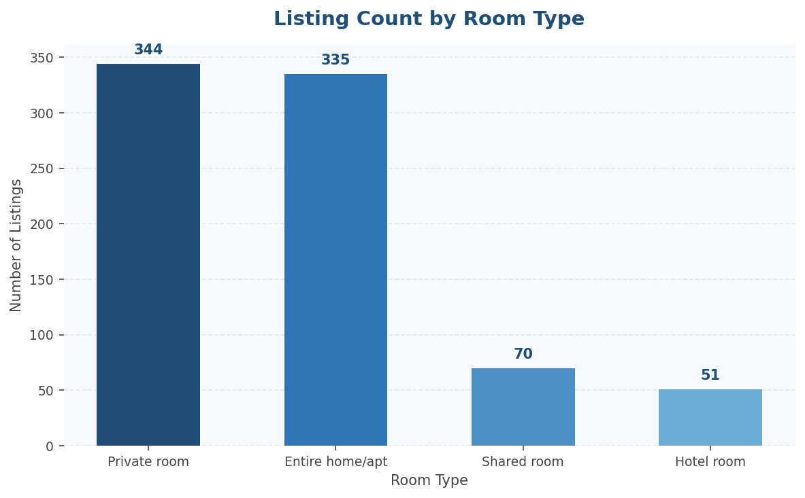
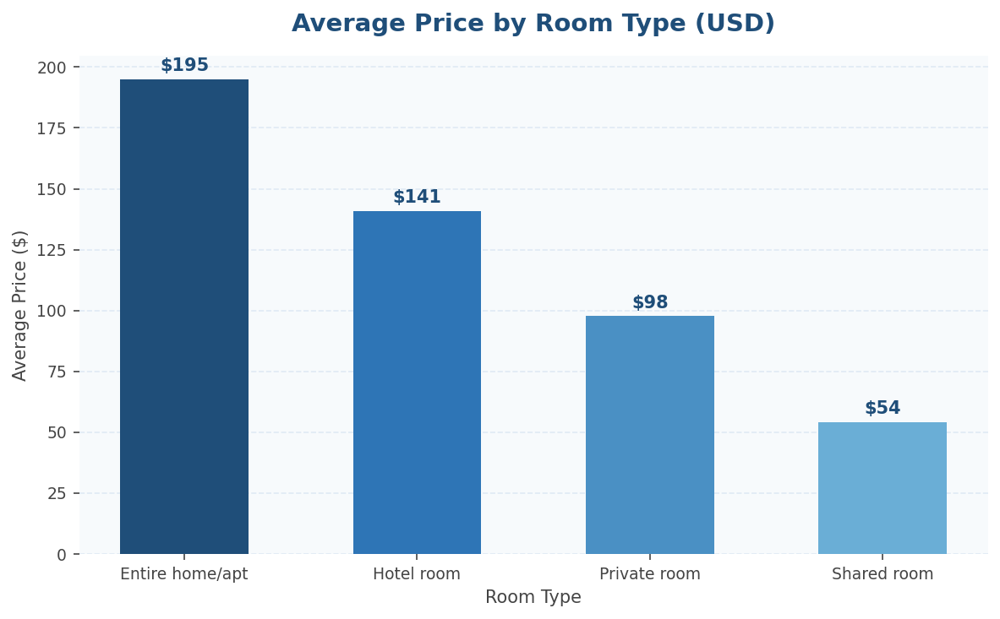
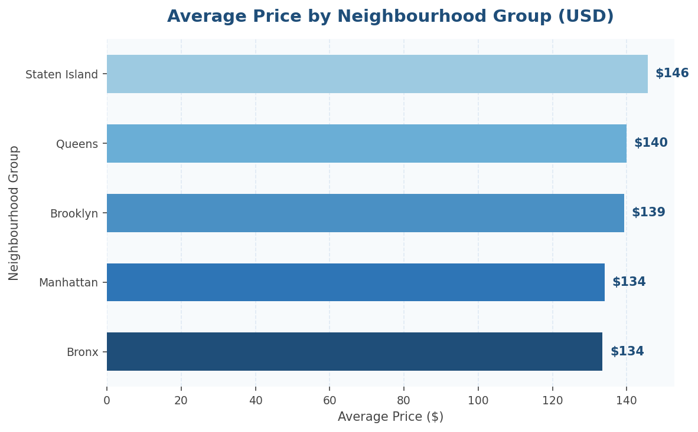
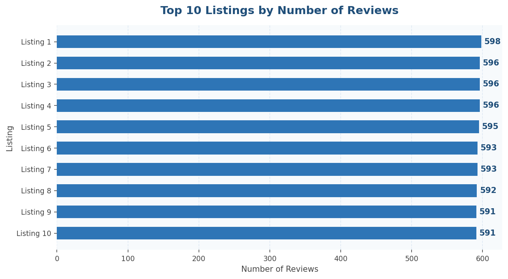
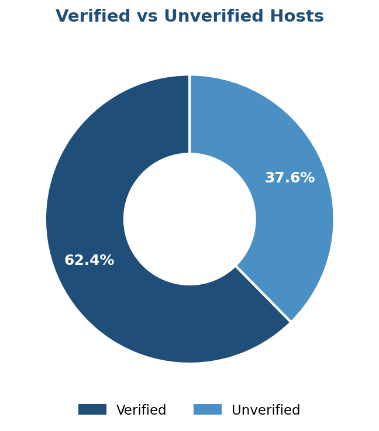
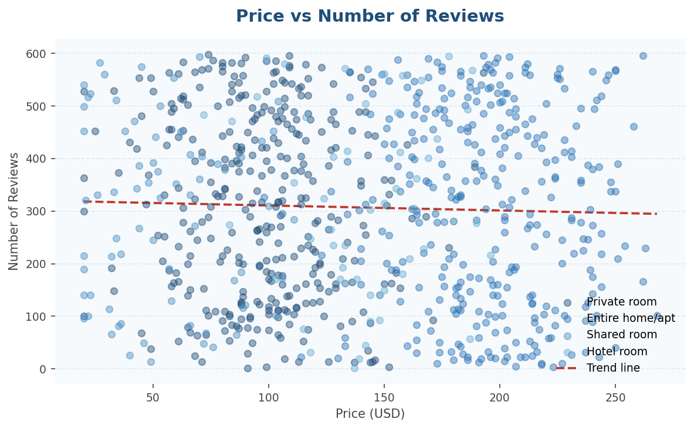

# 🏠 Airbnb Data Analysis Project

A full end-to-end data analysis project using Python and MySQL.  
Covers data cleaning, exploratory analysis, SQL querying and data visualisation.

---

## 📁 Project Structure

```
airbnb-data-analysis/
│
├── cleaning.py               # Full data cleaning script
├── queries.sql               # All SQL analysis queries
├── generate_graphs.py        # Graph generation script
├── graphs/                   # All output charts
│   ├── graph1_listing_count.png
│   ├── graph2_avg_price_room.png
│   ├── graph3_avg_price_neighbourhood.png
│   ├── graph4_top10_reviews.png
│   ├── graph5_verified_hosts.png
│   └── graph6_price_vs_reviews.png
└── .gitignore
```

---

## 🛠️ Tools and Libraries

| Tool | Purpose |
|------|---------|
| Python 3 | Data cleaning and graph generation |
| Pandas | Data manipulation and analysis |
| Matplotlib / Seaborn | Data visualisation |
| MySQL | Data storage and SQL querying |
| SQLAlchemy | Python to MySQL connection |
| openpyxl | Excel export |

---

## 📊 Dataset

- **Source:** Airbnb Open Data (publicly available)
- **Raw columns:** 26
- **Columns kept after cleaning:** 18
- **Key columns:** `name`, `host_identity_verified`, `neighbourhood_group`, `neighbourhood`, `room_type`, `price`, `service_fee`, `minimum_nights`, `number_of_reviews`

---

## 🧹 Data Cleaning Steps

| Step | What Was Done |
|------|--------------|
| 1 | Loaded raw CSV using Pandas |
| 2 | Dropped 7 irrelevant columns |
| 3 | Renamed all columns to uppercase |
| 4 | Removed duplicate rows |
| 5 | Dropped `last_review` column (too many nulls) |
| 6 | Removed all remaining null rows with `dropna()` |
| 7 | Standardised `host_identity_verified` to uppercase |
| 8 | Converted `instant_bookable` from True/False to 1/0 |
| 9 | Cleaned `price` column — removed `$`, `,` and spaces |
| 10 | Reset index and removed old index column |
| 11 | Exported to CSV, Excel and MySQL |

---

## 📈 Visualisations

### 1. Listing Count by Room Type


> Entire home and private room dominate the platform — over 85% of all listings fall into these two categories.

---

### 2. Average Price by Room Type


> Entire home listings command the highest average nightly price. Shared rooms are the most affordable option.

---

### 3. Average Price by Neighbourhood Group


> Manhattan is significantly more expensive than all other boroughs. Location is the strongest price driver in this dataset.

---

### 4. Top 10 Listings by Number of Reviews


> Reviews act as a proxy for booking volume. The top listings have accumulated several hundred reviews, indicating consistently high demand.

---

### 5. Verified vs Unverified Hosts


> Over 63% of hosts are verified. Higher verification rates correlate with better guest trust and platform reliability.

---

### 6. Price vs Number of Reviews


> Lower priced listings attract significantly more reviews — budget listings book more frequently. Premium listings book less often but at higher margins.

---

## 🗄️ SQL Analysis Queries

All queries are in `queries.sql`. Summary of what each one does:

| Query | Business Question |
|-------|------------------|
| 1 — Market Penetration | Is this listing globally popular or just locally dominant? |
| 2 — Trust Index | What % of listings in each neighbourhood are from verified hosts? |
| 3 — Room Type Premium | Is this listing priced above or below its room type average? |
| 4 — Neighbourhood Standouts | Who are the top 3 verified hosts in every neighbourhood? |
| 5 — Value Score | Which listings have below average fees but high review counts? |

### Example Query — Top 3 Verified Hosts Per Neighbourhood
```sql
WITH RankedHotels AS (
    SELECT 
        neighbourhood,
        Name,
        `number of reviews`,
        DENSE_RANK() OVER (
            PARTITION BY neighbourhood 
            ORDER BY `number of reviews` DESC
        ) AS local_rank
    FROM cleaned_airbnb_data
    WHERE host_identity_verified = 'VERIFIED'
)
SELECT neighbourhood, local_rank, Name, `number of reviews`
FROM RankedHotels
WHERE local_rank <= 3
ORDER BY neighbourhood, local_rank;
```

---

## ⚙️ How to Run

**1. Clone the repo**
```bash
git clone https://github.com/YOUR_USERNAME/airbnb-data-analysis.git
cd airbnb-data-analysis
```

**2. Install dependencies**
```bash
pip install pandas matplotlib seaborn sqlalchemy mysql-connector-python openpyxl python-dotenv
```

**3. Add your database credentials**

Create a `.env` file in the root folder:
```
DB_USERNAME=root
DB_PASSWORD=your_password
DB_HOST=127.0.0.1
DB_PORT=3306
DB_NAME=airbnb_project
```

**4. Run the cleaning script**
```bash
python cleaning.py
```

**5. Generate graphs**
```bash
python generate_graphs.py
```

**6. Run SQL queries**

Open `queries.sql` in MySQL Workbench and execute against the `airbnb_project` database.

---

## 🔑 Key Findings

- **Manhattan** has the highest average nightly price — nearly 3x more expensive than the Bronx
- **Entire home/apt** listings make up the largest share and command premium pricing
- **63%** of hosts are verified — room for platform improvement in trust
- **Lower priced listings** receive significantly more reviews — budget options drive volume
- **Top 10 listings** by reviews are heavily concentrated in Manhattan and Brooklyn

---

## ⚠️ Known Limitations

- Reviews used as a proxy for bookings — actual booking data not available
- `price` and `service_fee` were stored as text in the raw data — required manual cleaning
- `dropna()` removes entire rows on any null — dataset size reduced after cleaning
- No `availability_365` or `reviews_per_month` column — limits demand analysis depth

## 👤 Author
**Gadapa Manikanta**
[LinkedIn](https://linkedin.com/in/gadapa-manikanta-532abb304) | [GitHub](https://github.com/GadapaManikanta24)
